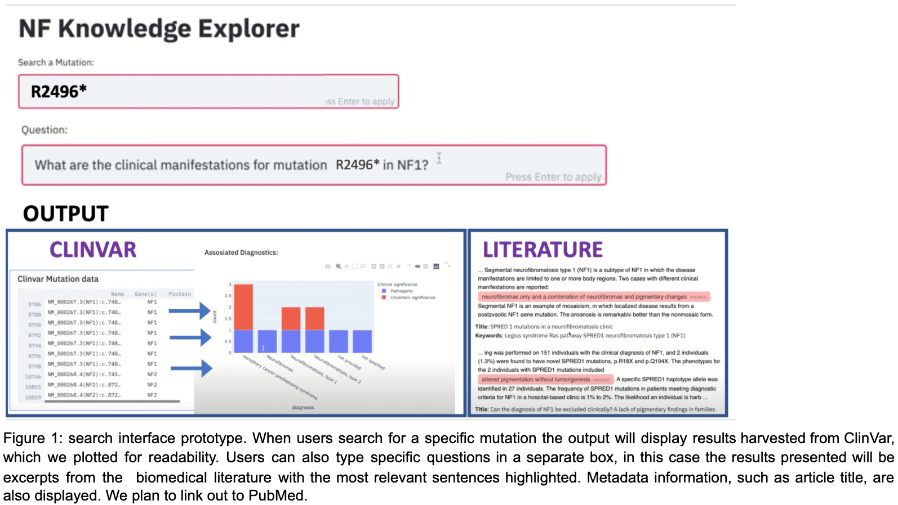

# NF Knowledge Explorer

NF Hackathon project 2020 
[Project Overview](https://nfhack-platform.bemyapp.com/#/projects/5f7fd37aed4283001b7bcd66aea32de67cd3ec908f71ce35e94b667748f45006!)

Our goal is to facilitate knowledge discovery by building an interactive tool where people can quickly explore literature data about NF and find answers effectively and accurately. We are interested in applying various NLP and data science techniques, such as question answering, topic mining, trend analysis and network analysis.

## Abstract
Patients often do not have the literacy nor the ability to access the full corpus of the research literature and to navigate and interpret data coming from various genetic and biomedical resources. Patients, though, know their symptoms very well, as well as their hard journey with NF. There's a need for a centralized user-friendly knowledge base that can collate all the available knowledge on NF, which can help them understand the disease when they are newly diagnosed, and guide them through the development of novel symptoms throughout their life. Most importantly, there’s a need for them to contribute to such a resource, as a community. With the NF Knowledge Explorer we apply state of the art NLP and Q&A models  to find meaningful and accurate answers which will be validated by the community itself, empowering patients with  knowledge. 

## Introduction 
Even though federally-funded science research should be readily made available to the public and should comply with the FAIR (findable, accessible, interoperable, and reusable) principles1, oftentimes, scientific articles are inaccessible to most because they remain behind paywalls. Accessing the biomedical literature is especially a daunting task for the patients who are trying to find answers for their medical condition. Patients often do not have the knowledge to mine the literature nor the ability to access copyright restricted papers. Patients are crucial in guiding their family doctors in their own care, and that is especially true for rare diseases with multiple manifestations such as neurofibromatosis. In addition, often, data is scattered across different sources and hard to retrieve for the lay public.  

## Methods
We are using NLP to be able to extract relevant information from the corpus of available research articles. We will include additional useful data from different sources, such as clinical variation data (ClinVar2) --which we already prototyped-- and patient registries, a notable example of which  is the NF Registry3, a project spearheaded by the Children’s Tumor Foundation. Additionally, we collected, cleaned and parsed 10000 PMC articles related to NF and informatics PDF documents from NF Registry. 

We used the state-of-the-art language model pre-trained on the large corpus of biomedical literature in the open-source NLP QA system framework to perform various NLP tasks such as Name Entity Recognition and extractive Question Answering. It’s worth noting that we can continue to fine-tune and improve the model customized to the NF domain as we continue to curate better label dataset. In addition, based on the semantic similarity to the questions in the FAQ doc, a retrieval based Question Answer model can complement and provide better quality control on the information retrieval results. We built the prototyping app using the streamlit and plotly. We also followed the best engineering practices for ML model serving and dockerization to ensure reproducibility and maintainability. 

## Results 
We had developed a prototype that supports the following search functionalities:
- Search a mutation box: This function will help users to readily find available information on their specific mutation. By typing in a specific mutation, the tool retrieves all known manifestations listed on the ClinVar website. The output is a table that summarizes the described conditions associated with the mutation and if the variation is pathogenic, of uncertain significance, or benign. We added a graphical visualization of the results to make it more user-friendly. 

- Question box: By typing in a question, the tool retrieves the most relevant documents and highlights the best answer from the credible literature data.

A prototype of the search interface is shown in figure 1:

Additionally, we curated a [FAQ doc](https://docs.google.com/spreadsheets/d/1h93-CZ6cTbzeqHC7-oOcqA1HfIRlg2oJPNgi2nm5cTQ/edit#gid=109873160) as an example to help us validate the model results and prepare for the retrieval-based/hybrid QA model approach for better quality control. We also use an open-source annotation tool to suggest a better feedback loop to help the community crowd-source information to ensure accuracy of information and facilite knowledge discovery.

## Conclusion/Discussion: 
We successfully designed and prototyped an end-to end-system to retrieve data from the literature and an additional source (ClinVar) and output meaningful insights in a centralized fashion. We trust that this tool, in its mature phase, will bring answers and guidance to patients in the  management of their disease. We also think that the community will feel empowered to share their knowledge and contribute to a repositository that benefits, above all, the community itself.

### Please make sure you address ALL of the following:

#### *1. What additional data would you like to have*
Blog post answers from the Neurofibromatosis Network support group website4  (Inspire), More full text data from NF  literature

#### *2. What are the next rational steps?* 
We want to augment and consolidate the most common questions in a continuous and controlled manner. Having a FAQ will allow us to use a retrieval-based/hybrid QA model which achieves the most accurate performance since it's better curated. What we do here aims to lay the foundation to continuously improve the information flow. The curated FAQ doc can be even added on the Children's Tumor Foundation website.

#### *3. What additional tools or pipelines will be needed for those steps?*
More deep dive analyses into the literature data, Deep learning computation resources, Deployment and monitoring through Heroku/AWS

#### *4. What skills would additional collaborators ideally have?*
We welcome developers with strong UI and web development expertise or someone with knowledge of GWAS datasets.

## Reproduction: *How to reproduce the findings!*
Note that in order to fully reproduce the results, the commputation environment and data files structure should be properly in place. 

### Docker

1. `docker push jpsfwork99/nfke-qa-cpu` command to pull the NLP QA model and API serving image from the DockerHub
2. `docker push jpsfwork99/nfke-app` command to pull the Streamlit App image from the DockerHub
3. `docker-compose up` Launch the whole Application with Elasticsearch as the backend DB, and mount the data and scripts folders. Note that the initial Elasticsearch won't contain any documents.
4. `docker exec nf_hackathon_cureate_nfke-qa-api_1 python script/clean_docs_indexing.py` Used the launched QA model image to clean/parse the data and index documents into the Elasticsearch
5. Check `http://127.0.0.1:8000/docs#` for QA model serving endpoints and check `http://localhost:8501/` whether the streamlit app is successfully launched. 

**Troubleshooting:** If the docker containers aren't running, please consider to increase the memory of the docker service by following the suggestions [here](https://stackoverflow.com/questions/32834082/how-to-increase-docker-machine-memory-mac). And you can rebuild an individual docker using the corresponding `Dockerfile` for debugging.

### Data folder 
Our primary data sources include **Elsevier literature** provided by _synapse_, **PMC literature** scraped by the `biopython` package, **NF general information** scraped from the Children Foundation website and **Clinvar** data exported from its website. Note that all the data should be unzipped and properly cleaned to be consumable for the following data science work. To get access to the cleaned dataset, please contact the authors by submitting an issue on Github. 

## References:
1. Wilkinson et al. The FAIR Guiding Principles for scientific data management and stewardship. Sci Data. 2016 Mar 15;3:160018. doi: 10.1038/sdata.2016.18. Erratum in: Sci Data. 2019 Mar 19;6(1):6. PMID: 26978244; PMCID: PMC4792175.
2. https://www.ncbi.nlm.nih.gov/clinvar/
3. https://www.ctf.org/understanding-nf/nf-registry
4. https://www.inspire.com/groups/neurofibromatosis-network/

